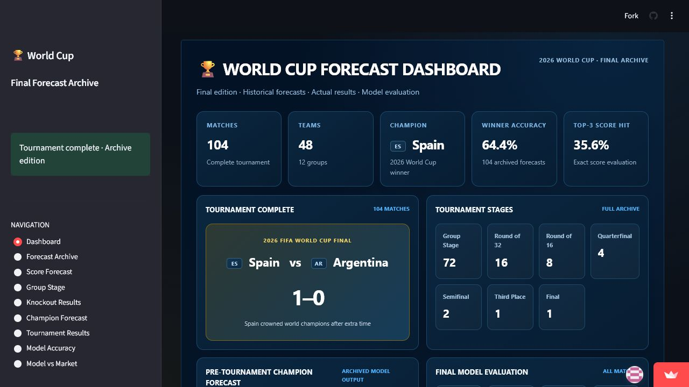
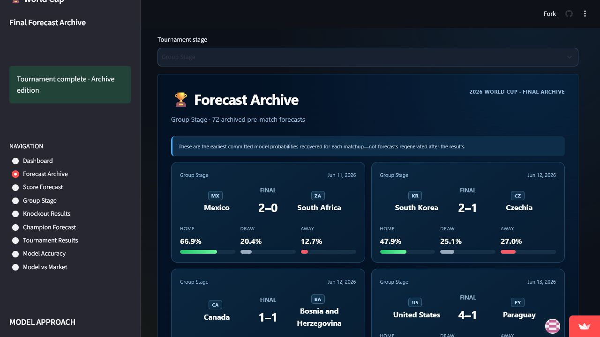
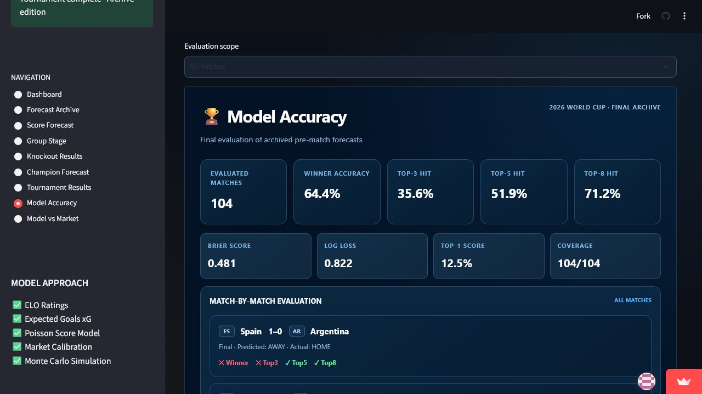
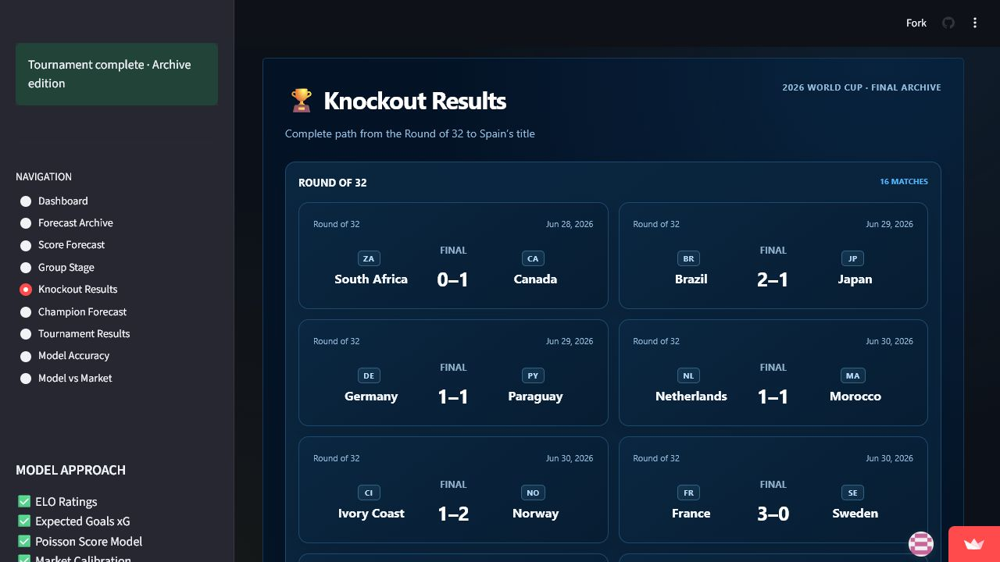

# 2026 World Cup Forecast Platform

### Final Tournament Analytics & Model Evaluation

An end-to-end quantitative football forecasting project built with **ELO team-strength modeling**, **expected-goals-style scoring intensities**, **Poisson score forecasting**, **market-probability adjustment**, and **Monte Carlo tournament simulation**.

The platform operated as a live forecasting system during the tournament. With the tournament complete, it now serves as a permanent research archive containing the original pre-match forecasts, final results, tournament progression, and post-tournament model evaluation.

> **Tournament completed.** Live forecasting and scheduled automation have been retired. The public application now presents the final historical archive.

## Public Dashboard

**Streamlit application:**

https://world-cup-forecast-platform.streamlit.app/

The final dashboard contains nine research and archive views:

- Final tournament dashboard
- Historical forecast archive
- Exact-score forecast archive
- Group-stage qualification archive
- Complete knockout results
- Pre-tournament champion forecast
- Complete tournament results
- Final model evaluation
- Archived model-versus-market analysis

## Project Motivation

International tournament forecasting is a useful applied probability problem because the system must connect several layers of uncertainty:

- latent team strength is not directly observable;
- match scores are discrete, low-frequency outcomes;
- draws require an explicit probability rather than a binary winner model;
- a tournament path compounds uncertainty across group and knockout stages;
- market odds contain information but also include bookmaker margin;
- model quality must be evaluated using forecasts fixed before outcomes are known.

The project objective was therefore not to produce a single deterministic bracket. It was to build a reproducible probability pipeline that converts pre-match information into internally consistent score, match-outcome, qualification, and championship distributions, then preserves those forecasts for ex-post evaluation.

From a Financial Engineering perspective, the project emphasizes concepts that also appear in quantitative risk work: latent-state estimation, probability normalization, distributional forecasting, Monte Carlo scenario generation, calibration diagnostics, proper scoring rules, and strict separation of information available before and after an event.

## Forecasting Architecture

```text
Team ELO ratings + tournament fixtures
                    |
                    v
       Match-level scoring intensities
          (home xG and away xG)
                    |
                    v
       Independent Poisson score matrix
                    |
          +---------+---------+
          |                   |
          v                   v
 Ranked exact scores    Model 1X2 probabilities
                              |
                              v
                Market-implied probabilities
                 (overround removed, if available)
                              |
                              v
                    Adjusted 1X2 forecast
                              |
          +-------------------+-------------------+
          |                                       |
          v                                       v
  Group-stage Monte Carlo              Knockout/tournament simulation
          |                                       |
          v                                       v
 Qualification probabilities             Championship probabilities
                              |
                              v
             Versioned reports + Streamlit dashboard
                              |
                              v
              Post-tournament archive and evaluation
```

## Final Dashboard



## Tournament Archive

The permanent archive preserves the earliest committed pre-match probabilities recovered for all 104 matchups and pairs them with the completed tournament results.



## Final Model Evaluation

The archived forecasts were evaluated against all 104 final results. The dashboard reports three-way outcome performance, ranked exact-score hit rates, and probabilistic scoring metrics.

| Evaluation metric | Final result |
| --- | ---: |
| Evaluated matches | 104 |
| Three-way outcome hit rate | 64.4% |
| Top-1 exact-score hit rate | 12.5% |
| Top-3 exact-score hit rate | 35.6% |
| Top-5 exact-score hit rate | 51.9% |
| Top-8 exact-score hit rate | 71.2% |
| Brier score | 0.481 |
| Log loss | 0.822 |



## Complete Knockout Results



## Project Lifecycle

### 1. Model development

The forecasting system combined relative team strength, expected scoring rates, score-distribution modeling, market information, and tournament simulation.

### 2. Live tournament operation

An automated GitHub Actions pipeline collected data, generated reports, refreshed forecasts, and supplied the public Streamlit dashboard during the tournament.

### 3. Historical recovery

When the live APIs no longer returned the complete tournament dataset, the final archive was reconstructed from committed pre-match snapshots preserved in the repository history. Forecasts shown in the archive were not regenerated after the results were known.

### 4. Final evaluation

All recovered forecasts were matched with the completed tournament results to produce the permanent model evaluation and research archive. Live forecasting and scheduled updates are now retired.

## Quantitative Methodology

### 1. Information set and forecast timestamp

Each match forecast is associated with a fixture, two pre-match team ratings, and—when available—market odds. The final archive selects the earliest committed probability snapshot for each matchup from Git history. This point-in-time rule prevents a later dashboard refresh or known match result from replacing the original forecast.

The unit of analysis is one match. The principal probabilistic target is the three-way result

```text
Y ∈ {HOME, DRAW, AWAY}
```

with a secondary target consisting of the ranked exact-score distribution.

### 2. ELO team-strength representation

ELO ratings provide a compact pre-match representation of relative national-team strength. For teams `h` and `a`, the relevant signal is the rating difference

```text
ΔELO = ELO_h - ELO_a
```

The current implementation treats the ratings as external point-in-time inputs. It does not re-estimate the ELO update coefficient inside this repository, so ELO should be interpreted as an input feature rather than a model trained on the final tournament sample.

### 3. Expected-goals-style scoring intensities

The ELO difference is mapped into match-level Poisson intensities:

```text
λ_home = clip(1.35 + ΔELO / 350, 0.40, 3.50)
λ_away = clip(1.35 - ΔELO / 350, 0.40, 3.50)
```

These quantities are displayed as home and away xG because they represent expected scoring rates. More precisely, they are **ELO-derived scoring intensities**, not shot-level xG estimates trained on event data. The clipping bounds limit extreme forecasts and the symmetric construction implies a baseline total-goals expectation of 2.70 before clipping.

### 4. Poisson score distribution

Conditional on the scoring intensities, home and away goals are modeled as independent Poisson variables:

```text
H ~ Poisson(λ_home)
A ~ Poisson(λ_away)

P(H=h, A=a) = P(H=h) × P(A=a)
```

The implementation evaluates scorelines from 0 through 6 goals for each team. The resulting score matrix is ranked to produce the Top-1, Top-3, Top-5, Top-8, and Top-10 exact-score forecasts. Three-way match probabilities are obtained by summing cells where `h > a`, `h = a`, and `h < a`, followed by normalization over the represented score grid.

### 5. Market-implied probabilities and linear pooling

Decimal odds are converted to implied probabilities and normalized to remove the quoted overround:

```text
q_i = (1 / odds_i) / Σ_j(1 / odds_j)
```

When market data are available, the final match probabilities use a convex linear pool:

```text
p_adjusted = 0.80 × p_model + 0.20 × q_market
```

The three adjusted probabilities are normalized to sum to one. When odds are unavailable, the model probabilities are retained. This step is best described as **market adjustment or linear probability pooling**; it is not a fitted statistical calibration model. The archived model-versus-market page reports the divergence between the two probability sources for research comparison only.

### 6. Group-stage Monte Carlo simulation

The group-stage engine runs 10,000 simulations with a fixed random seed for reproducibility. For each simulated match, it samples a home/draw/away result from the adjusted 1X2 probabilities and generates a compatible scoreline using the Poisson intensities. Simulated tables apply points, goal difference, and goals scored; unresolved ties receive a random tie-breaker.

Across simulations, the engine estimates first-place, second-place, qualification, third-place, and last-place probabilities, together with expected points and goal difference.

### 7. Knockout and championship simulation

The tournament simulator propagates uncertainty through the expanded knockout structure. Group-stage scorelines are simulated from the match intensities, 32 teams qualify, and knockout winners advance recursively. A tied knockout simulation is resolved using an ELO-strength probability as an approximation for extra time and penalties.

The simulator records advancement frequencies at each round and estimates championship probability as

```text
P(champion = team i) ≈ championship count_i / 10,000
```

The pre-tournament champion ranking shown in the final archive is the preserved simulation output, not a probability recomputed after the champion was known.

## Evaluation Design

### Point-in-time archive construction

The live APIs eventually stopped returning the full tournament. To avoid evaluating only the remaining matches, the archive builder traverses committed report versions and selects the earliest available pre-match snapshot for each normalized matchup. It then aligns home/away orientation and joins the preserved probabilities to the final results.

This design provides a defensible audit trail: forecast values come from repository history, while realized outcomes come from the completed results archive. The final dashboard itself is static and does not rerun the model.

### Three-way outcome hit rate

The predicted class is the largest of the home, draw, and away probabilities. The reported 64.4% is the fraction of 104 archived matches for which that class equals the recorded result class. It is a descriptive hit rate, not sufficient by itself to establish probability quality.

### Ranked exact-score hit rates

For each match, the realized score is compared with the ranked Poisson score list. Top-k hit rate is

```text
Top-k hit rate = matches with realized score in first k forecasts / 104
```

The nested Top-1, Top-3, Top-5, and Top-8 metrics show how quickly the ranked distribution captures the realized score as coverage expands.

### Multiclass Brier score

For each match, the implementation calculates the unscaled three-class Brier score

```text
BS = Σ_c (p_c - y_c)²
```

and reports its mean across matches. Lower is better. Under this convention the score ranges from 0 to 2; it is not divided by the number of classes.

### Multiclass log loss

Log loss evaluates the probability assigned to the realized class:

```text
LL = -(1/N) Σ_i log(p_i,actual)
```

Lower is better, and confident incorrect forecasts receive a larger penalty. Together, Brier score and log loss assess the full probability vector rather than only the most likely class.

## Assumptions and Limitations

- The ELO-to-intensity mapping is a transparent heuristic, not a statistically estimated shot-level xG model.
- Independent Poisson scoring omits within-match dependence, tactical state changes, red cards, injuries, and score effects.
- The score grid is truncated at six goals per team; match-outcome probabilities are normalized over that represented grid.
- The 80/20 market pool is a fixed modeling choice and was not optimized on a separate validation sample.
- Market coverage is incomplete, so some matches use model-only probabilities.
- Group tie-breaks and knockout resolution use reproducible approximations rather than every official competition rule.
- The championship simulation uses a seeded approximation for the expanded knockout bracket rather than the final official FIFA mapping.
- Recorded knockout scores may reflect extra time or penalty conventions, while the original 1X2 probabilities are closest to a regulation-time match model. Final evaluation metrics should therefore be read as descriptive archive diagnostics.
- No naive baseline, bookmaker-only benchmark, calibration curve, confidence interval, or statistical significance test is currently reported. The results demonstrate an end-to-end forecasting workflow, not proof of universal model superiority.

These limitations are intentionally documented so that observed results, model estimates, and methodological judgment remain separate.

## Final Tournament Coverage

| Item | Coverage |
| --- | ---: |
| National teams | 48 |
| Groups | 12 |
| Group-stage matches | 72 |
| Round of 32 | 16 |
| Round of 16 | 8 |
| Quarterfinals | 4 |
| Semifinals | 2 |
| Third-place match | 1 |
| Final | 1 |
| Total archived forecasts and results | 104 |
| Tournament simulations | 10,000+ |

## Technology Stack

- **Programming:** Python
- **Data processing:** pandas, NumPy
- **Statistical modeling:** SciPy, scikit-learn
- **Visualization:** Streamlit, Plotly
- **Automation:** GitHub Actions
- **Deployment:** Streamlit Community Cloud

## Repository Structure

```text
World-Cup-Forecast-Platform/
├── api/                    # Historical data-acquisition clients
├── dashboard/              # Final Streamlit archive and preserved live-era app
│   ├── app.py              # Public final archive
│   ├── app_live_legacy.py  # Preserved tournament-period dashboard
│   └── archive_data/       # Materialized final archive datasets
├── data/                   # Raw and processed project data
├── models/                 # Forecasting models
├── reports/                # Forecast reports and historical outputs
├── screenshoots/           # Dashboard documentation images
├── scripts/                # Original pipeline scripts
├── simulation/             # Monte Carlo simulation engine
└── validation/             # Model evaluation framework
```

## Run the Final Dashboard Locally

Install the existing project dependencies:

```bash
pip install -r requirements.txt
```

Launch the archived dashboard:

```bash
streamlit run dashboard/app.py --server.port 8503
```

The final application reads only the repository's archived dashboard datasets. It does not call live APIs, run the forecast pipeline, or execute subprocesses.

## Archive Status

| Component | Status |
| --- | --- |
| Live forecasting | Retired |
| Scheduled automation | Retired |
| Historical forecast recovery | Complete |
| Final model evaluation | Complete |
| Public Streamlit archive | Deployed |

## Author

### Fenglei Wu

**M.S. Financial Engineering**

Claremont Graduate University

Areas of focus:

- Quantitative Research
- Forecasting Models
- Risk Analytics
- Data Science
- Sports Analytics

GitHub: https://github.com/kevinwu1994

## Disclaimer

This project is intended for quantitative research, analytics, education, and portfolio demonstration only. It does not provide betting recommendations, financial advice, wagering guidance, or commercial forecasting services.
